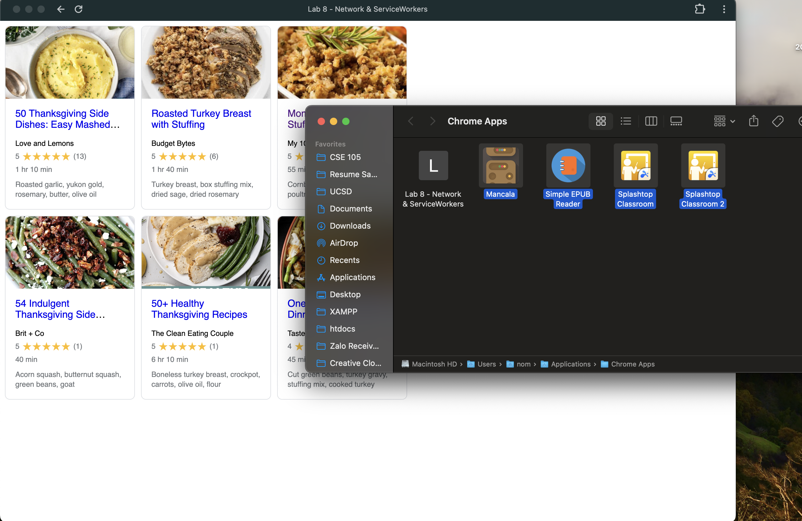

# Lab8-Starter

Nam Nguyen
Page URL: https://afacade.github.io/Lab8-Starter-v2/index.html

PWA.PNG:

Graceful degradation and service workers are related because service workers help web apps stay usable even when things go wrong. Service workers can save important files and data so that users can still access the app when they are offline or have a poor internet connection. This supports graceful degradation by ensuring that the main features of the app work, even if some advanced functions don't. In other words, service workers help keep web apps functional and user-friendly
